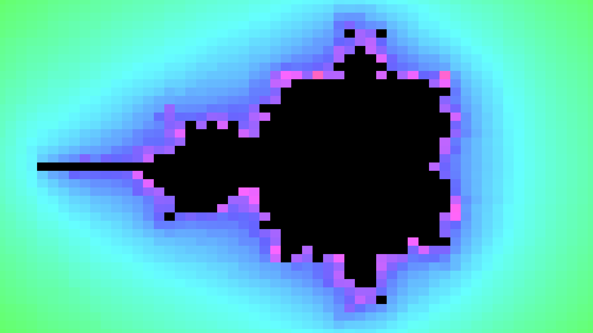
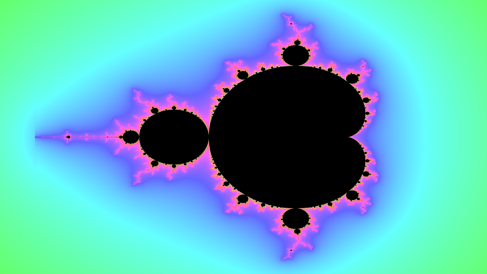

# Mandelbrot set renderer using fixed point
The Mandelbrot set 

is the set of complex numbers 

for which the recurrence relation

does not diverge when iterated. The Mandelbrot set is oftan shown to illustrate the beauty of mathematics.

---

2 Fractional bits

---

4 Fractional bits

---

6 Fractional bits

---

8 Fractional bits

---

10 Fractional bits

---

15 Fractional bits

---

